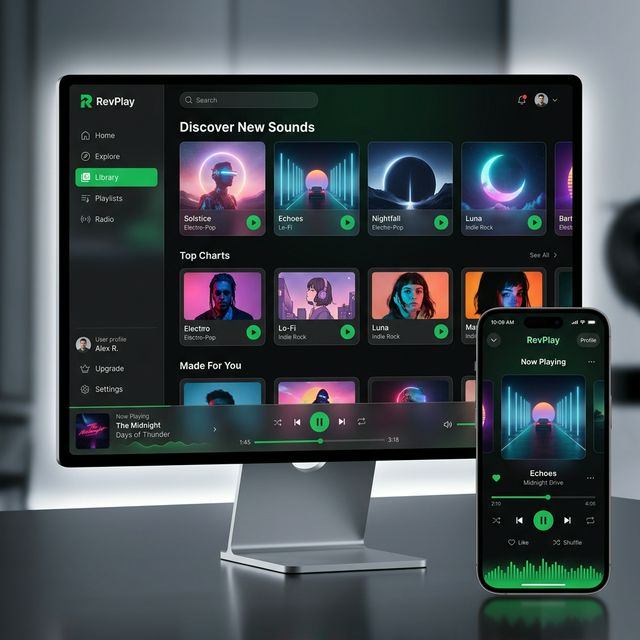
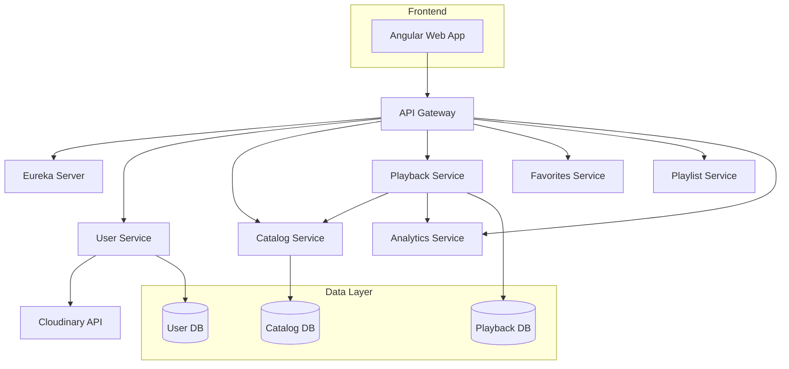

# RevPlay - Premium Microservices Music Platform 🎵



RevPlay is a high-performance, scalable music streaming platform built on a modern microservices architecture. It features a stunning, mobile-responsive frontend and a robust backend designed for reliability and speed.

## 🚀 Key Features

- **Mobile First Design:** Fully responsive UI that adapts perfectly to desktop, tablet, and mobile screens.
- **Microservices Architecture:** 10+ independent services providing high availability and modular scaling.
- **Artist Dashboard:** Comprehensive metrics and management for creators to upload and track their music.
- **Smart Playback:** Real-time playback synchronization and advanced queue management.
- **Scalable Discovery:** Fast search and personalized recommendations via the Catalog and Analytics services.
- **Cloud Integrated:** Automated profile and asset management via Cloudinary.

## 🛠️ Technology Stack

| Layer | Technologies |
|-------|--------------|
| **Frontend** | Angular 18+, Tailwind CSS, RxJS |
| **Backend Core** | Java 21, Spring Boot 3.x, Spring Cloud |
| **Security** | Spring Security, JWT (RFC 7519), Feign Interceptors |
| **Database** | MySQL, Hibernate JPA, Liquibase |
| **Service Mesh** | Netflix Eureka (Discovery), Spring Cloud Gateway |
| **Infrastructure** | Spring Cloud Config Server, OpenFeign |

## 🏗️ Architecture Overview



## ⚙️ How to Run

### Backend Initialization
1. Ensure **MySQL** is running and the necessary databases are created.
2. Start the **Config Server** (Port 8888).
3. Start the **Eureka Server** (Port 8761).
4. Run the remaining microservices via the provided script:
   ```powershell
   ./start-backend-local.ps1
   ```

### Frontend Setup
1. Navigate to `revplay-frontend`.
2. Install dependencies:
   ```bash
   npm install
   ```
3. Start the dev server:
   ```bash
   npm run start
   ```

## 📈 Recent Updates
- ✅ **Implemented Mobile Responsiveness:** Enhanced Navbar with hamburger menu and toggleable sidebar.
- ✅ **Optimized Playback Integrity:** Resolved `NonUniqueResultException` and improved state management.
- ✅ **Security Hardening:** Implemented global JWT propagation via Feign Interceptors.

---
Built with ❤️ by [Aishwarya](https://github.com/Aishwarya12456)
